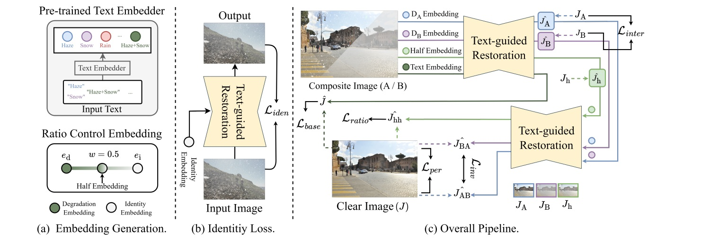

# CURE

Official implementation of **CURE: Controllable Unified Image Restoration for
Complex Degradations** (ICPR 2026).

[[Project page](https://bo-oseng.github.io/CURE/)]
[[Live demo](https://huggingface.co/spaces/ses7720/CURE-Demo)]
[[Paper](https://arxiv.org/abs/2607.03044)]
[[CCDD-11 dataset](https://huggingface.co/datasets/ses7720/CCDD-11)]
[[Pretrained models](https://huggingface.co/ses7720/CURE)]



CURE extends unified image restoration with explicit control over what to
restore, how strongly to restore it, and the order in which multiple
degradations are removed.

## Installation

Python 3.11 and the CUDA 12.8 build of PyTorch are recommended. Create the
environment, install PyTorch first, and then install the remaining project
dependencies:

```bash
conda create -n cure python=3.11 -y
conda activate cure
pip install torch==2.11.0 torchvision==0.26.0 torchaudio==2.11.0 --index-url https://download.pytorch.org/whl/cu128
pip install -r requirements.txt
```

## Dataset

Download [CCDD-11 from Hugging Face](https://huggingface.co/datasets/ses7720/CCDD-11):

```bash
pip install -U huggingface_hub
hf download ses7720/CCDD-11 --repo-type dataset --local-dir data
```

The training utilities expect the extracted data under
`data/half_train/main_data`, `data/half_train/sub_data`, and
`data/half_test/main_data`. Raw data and generated HDF5 files are ignored by
Git.

Build the aligned patch database used for CURE training:

```bash
python tools/prepare_h5.py cure
```

The following additional command is only needed when retraining the
OneRestore baseline from scratch. It creates `datasets_h5/half_og_train.h5`,
which is consumed by `bash/trian/02_train_OneRestore_baseline.sh`:

```bash
python tools/prepare_h5.py baseline
```

## Checkpoints

Download the released checkpoints from the
[CURE model repository on Hugging Face](https://huggingface.co/ses7720/CURE):

```bash
pip install -U huggingface_hub
hf download ses7720/CURE \
  CURE_restorer.tar \
  OneRestore_embedder.tar \
  OneRestore_restorer.tar \
  --local-dir checkpoints
```

| File | Usage |
| --- | --- |
| `CURE_restorer.tar` | CURE inference and evaluation |
| `OneRestore_embedder.tar` | Prompt encoder used for inference and training |
| `OneRestore_restorer.tar` | Pretrained OneRestore baseline and CURE training initialization |

The same files are also available from this
[Google Drive mirror](https://drive.google.com/drive/folders/1xUXAgRPXZjntPR4m4BCh8Tyw2BXGhqSE?usp=sharing).
Hugging Face is the recommended source because it provides versioned model
hosting and more reliable command-line downloads.

## Gradio demo

The Gradio app exposes all five controllable inference modes as separate tabs:
one-step, ratio, selective, identity, and two-stage restoration. It uses local
checkpoints when they exist and otherwise downloads the released weights from
`ses7720/CURE` into the Hugging Face cache.

Run it locally with:

```bash
python app.py
```

By default, the app uses CUDA when available, processes one request at a time,
and limits the longest image side to 1024 pixels. These settings can be
overridden with `CURE_DEVICE` and `CURE_MAX_IMAGE_SIDE`. Each tab also includes
clickable example images covering all 11 CCDD-11 degradation combinations, so
the hosted demo can be tried without uploading an image.

## Inference

Place the CURE restorer and OneRestore embedder weights in `checkpoints/` as
`CURE_restorer.tar` and `OneRestore_embedder.tar`.

### Inference commands

Run the commands below from the repository root. They use these files by
default:

```text
checkpoints/CURE_restorer.tar
checkpoints/OneRestore_embedder.tar
data/half_test/main_data/<degradation>
```

Pass `--checkpoint checkpoints/OneRestore_restorer.tar` to run the pretrained
OneRestore baseline instead of CURE. Use `--device cuda:1` to select a GPU or
`--device cpu` to force CPU inference. All commands accept common image formats
such as PNG, JPEG, BMP, TIFF, and WebP.

The shell wrappers under `bash/inference/` provide scenario defaults and keep
all results in a consistent hierarchy. Run them from any directory:

```bash
bash bash/inference/inference_identity.sh
bash bash/inference/inference_main.sh
bash bash/inference/inference_ratio_control.sh
bash bash/inference/inference_selective_control.sh
bash bash/inference/inference_twostage.sh
```

Their default output layout is:

```text
outputs/inference/
├── identity/clear/
├── main/haze/
├── ratio_control/haze/
│   ├── strength_0/
│   ├── ...
│   └── strength_1/
├── selective_control/low_haze/remove_haze/
└── twostage/low_haze/
    ├── stage1_low/
    └── stage2_low_then_haze/
```

Set `OUTPUT_ROOT` to preserve this hierarchy under another root, or set
`OUTPUT` to override one command's final output directory. `INPUT`, `PROMPT`,
`SOURCE_PROMPT`, `REMOVE`, `SEQUENCE`, and `PYTHON` are also configurable. Any
additional command-line arguments are forwarded to the Python script:

```bash
PROMPT=low_haze OUTPUT_ROOT=outputs/experiment_01 \
  bash bash/inference/inference_ratio_control.sh --device cuda:1

SOURCE_PROMPT=low_haze REMOVE=haze \
  bash bash/inference/inference_selective_control.sh

SOURCE_PROMPT=low_haze SEQUENCE="haze low" \
  bash bash/inference/inference_twostage.sh
```

| Script | Purpose |
| --- | --- |
| `demo.py` | Quickly process any image/folder and create before/after comparisons |
| `inference_main.py` | Remove the complete degradation with one full-strength pass |
| `inference_ratio_control.py` | Compare multiple restoration strengths |
| `inference_selective_control.py` | Remove only selected factors from a composite degradation |
| `inference_identity.py` | Test the learned identity/no-restoration condition |
| `inference_twostage.py` | Remove two factors sequentially in a chosen order |

#### Quick demo: `demo.py`

Use this command for an arbitrary image or directory that is not arranged like
the CCDD-11 test dataset. It applies one prompt at the selected strength and
saves both restored images and side-by-side input/output comparisons.

```bash
python demo.py \
  --input path/to/image_or_folder \
  --prompt low_haze \
  --strength 0.8 \
  --output outputs/demo
```

`--input` is required. A directory is searched recursively. `--strength` ranges
from `0` (identity/no restoration) to `1` (full prompt strength) and defaults to
`1`. The output layout is:

```text
outputs/demo/
├── restored/                  # restored images
└── comparison/                # input | restored, saved side by side
```

#### Full one-step restoration: `inference_main.py`

Use this command to remove one degradation or an entire composite degradation
in a single full-strength pass. For example, `--prompt low_haze` requests that
both low light and haze be removed together.

```bash
python inference_main.py \
  --prompt low_haze \
  --output outputs/main/low_haze
```

When `--input` is omitted, the command reads
`data/half_test/main_data/low_haze`. To process a particular image or folder,
provide it explicitly:

```bash
python inference_main.py \
  --input path/to/input.png \
  --prompt low_haze \
  --output outputs/main/restored.png
```

#### Ratio-controlled restoration: `inference_ratio_control.py`

Use this command to evaluate how the output changes as the prompt embedding is
interpolated between identity and full restoration. Each strength is processed
independently from the original input.

```bash
python inference_ratio_control.py \
  --prompt low_haze \
  --strengths 0 0.2 0.4 0.6 0.8 1 \
  --output outputs/ratio/low_haze
```

When `--strengths` is omitted, the default sweep is `0.0, 0.1, ..., 1.0`.
Strength `0` uses the identity embedding and strength `1` uses the complete
prompt embedding. Results are separated by strength:

```text
outputs/ratio/low_haze/
├── strength_0/
├── strength_0.2/
├── strength_0.4/
├── strength_0.6/
├── strength_0.8/
└── strength_1/
```

If `--input` is omitted, the input defaults to
`data/half_test/main_data/<prompt>`.

#### Selective restoration: `inference_selective_control.py`

Use this command to remove only part of a composite degradation. The source
prompt describes what is present in the image, while `--remove` specifies what
the model should remove. The following example removes haze from `low_haze`
images while leaving the low-light condition:

```bash
python inference_selective_control.py \
  --source-prompt low_haze \
  --remove haze \
  --output outputs/selective/low_haze_dehaze
```

Multiple factors can be selected when the corresponding composite embedding
exists. For example:

```bash
python inference_selective_control.py \
  --source-prompt low_haze_rain \
  --remove low rain \
  --output outputs/selective/remove_low_rain
```

The command validates that every requested factor occurs in `--source-prompt`.
If `--input` is omitted, it reads
`data/half_test/main_data/<source-prompt>`.

#### Identity inference: `inference_identity.py`

Use this command to inspect the model output under the learned identity
condition. No degradation prompt is encoded; the all-ones identity embedding
is passed to the restorer. This is useful for checking how well the model
preserves its input when no restoration is requested.

```bash
python inference_identity.py \
  --source-prompt low_haze \
  --output outputs/identity/low_haze
```

Here `--source-prompt` only selects the default input directory
`data/half_test/main_data/low_haze`; it does not condition the model. For an
arbitrary input, use `--input` instead:

```bash
python inference_identity.py \
  --input path/to/image_or_folder \
  --output outputs/identity/custom
```

#### Sequential two-stage restoration: `inference_twostage.py`

Use this command to remove the two factors of a composite degradation in two
successive model passes. It saves the intermediate image after the first pass
and the final image after the second pass.

```bash
python inference_twostage.py \
  --source-prompt low_haze \
  --sequence low haze \
  --output outputs/twostage/low_haze
```

For `--source-prompt low_haze`, omit `--sequence` to use `low haze`, or pass
`--sequence haze low` to test the reverse order. The sequence must contain both
source factors exactly once. Outputs are stored as:

```text
outputs/twostage/low_haze/
├── stage1_low/                # low removed first
└── stage2_low_then_haze/      # haze removed from the stage-1 result
```

If `--input` is omitted, the input defaults to
`data/half_test/main_data/<source-prompt>`.

## Embedder evaluation

Both evaluators load `checkpoints/OneRestore_embedder.tar` and
`assets/glove.6B.300d.txt` by default. Use `--checkpoint`, `--glove`, and
`--device` to override them.

### Embedder classification: `eval_embedder.py`

This command evaluates the visual branch of the embedder directly. The input
must contain one directory per degradation class, as in
`data/half_test/main_data/<class>/`. It reports overall and per-class top-1
accuracy, cross-entropy loss, the predominant prediction, and the complete
prediction distribution.

```bash
python eval_embedder.py
```

Evaluate selected classes or a small subset with:

```bash
python eval_embedder.py \
  --input data/half_test/main_data \
  --classes low haze low_haze \
  --batch-size 128 \
  --device cuda:0

python eval_embedder.py --classes clear --max-images 10 --device cpu
```

Detailed metrics are written to
`outputs/evaluation/embedder/metrics.json` by default. Change the destination
with `--output`.

### Ratio-control trend: `eval_ration_control.py`

This command reclassifies images produced by `inference_ratio_control.py` and
measures how their predicted degradation changes with restoration strength.
Generate the inputs and evaluate them with:

```bash
bash bash/inference/inference_ratio_control.sh

python eval_ration_control.py \
  --input outputs/inference/ratio_control
```

The evaluator discovers `<prompt>/strength_<value>/` directories automatically
and can restrict the evaluation to selected prompts and strengths:

```bash
python eval_ration_control.py \
  --input outputs/inference/ratio_control \
  --prompts haze low_haze \
  --strengths 0 0.5 1 \
  --device cuda:0
```

The output fields include source-degradation accuracy and probability, clear
probability, loss, and the predominant predicted class. `target_accuracy`
means that an output is still classified as its original degradation. With the
current inference convention, strength `0` is identity and strength `1` is
full restoration, so decreasing target probability and increasing clear
probability indicate that the degradation is being removed. Results are saved
as `metrics.json` and `metrics.csv` under
`outputs/evaluation/ratio_control/`; use `--output-dir` to change this path.
Historical `<prompt>_<percentage>` directories from the original notebook are
also supported.

## Training

The scripts use `torchrun`; set `GPUS` to the number of local GPU processes.

```bash
GPUS=4 bash bash/trian/01_train_OneRestore_embedder.sh
GPUS=4 bash bash/trian/02_train_OneRestore_baseline.sh
GPUS=4 bash bash/trian/03_train_CURE.sh
```

Run `python <script> --help` for all dataset, checkpoint, optimization, and
resume options.

## Acknowledgements

CURE builds upon
[OneRestore](https://github.com/gy65896/OneRestore), and this implementation
was developed with substantial reference to its official codebase. We thank
Yu Guo, Yuan Gao, Yuxu Lu, Huilin Zhu, Ryan Wen Liu, and Shengfeng He for
making their work and code publicly available.

## Citation

```bibtex
@inproceedings{kim2026cure,
  title     = {CURE: Controllable Unified Image Restoration for Complex Degradations},
  author    = {Kim, Boseong and Cho, Donghyeon},
  booktitle = {International Conference on Pattern Recognition},
  year      = {2026}
}
```
